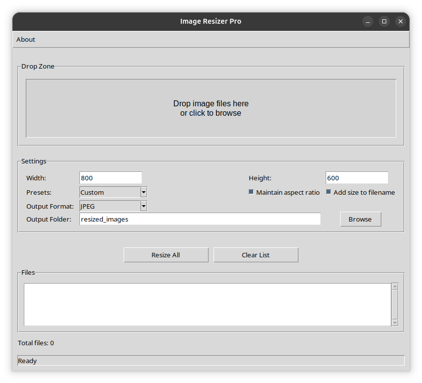

# 🖼️ Image Resizer Pro

A powerful and intuitive desktop application for batch resizing images with drag & drop support and advanced features.

## ✨ Features

- **📦 Batch Processing** - Resize multiple images simultaneously
- **🖱️ Drag & Drop Support** - Simply drag and drop images into the application
- **🔒 Aspect Ratio Preservation** - Maintain original image proportions automatically
- **📏 Custom Dimensions** - Set custom width and height values
- **⚡ Preset Sizes** - Quick selection of common resolutions (1920x1080, 1280x720, etc.)
- **🔄 Multiple Output Formats** - Save as JPEG, PNG, WEBP, or BMP
- **📝 Filename Customization** - Option to add dimensions to output filenames
- **🧠 Smart Format Conversion** - Handles transparency and color mode conversion automatically
- **📊 Progress Tracking** - Real-time status updates during processing
- **❗ Error Handling** - Detailed error reporting for failed operations
- **ℹ️ About Dialog** - Version and author information

## 👁️ Preview


## 📥 Installation

### ✅ Prerequisites
- Python 3.9 or higher
- Required Python packages

### 📦 Install from Source

1. Clone or download the repository:
```bash
git clone https://github.com/EvgeniyPavlenko85/image-resizer-pro.git
cd image-resizer-pro
```

2. Create a virtual environment (recommended):
```bash
python3 -m venv venv
source venv/bin/activate  # Linux/macOS
# venv\Scripts\activate  # Windows
```

3. Install required dependencies:
```bash
pip install -r requirements.txt
```

### 📋 Dependencies

The application requires the following Python packages:
- `Pillow` - For image processing
- `tkinterdnd2` - For drag & drop support

## 🚀 Usage

### 📊 Basic Workflow

1. **📂 Load Images**
   - Drag & drop image files into the drop zone, or
   - Click the drop zone to browse and select files

2. **⚙️ Configure Settings**
   - Set desired width and height
   - Choose from preset resolutions
   - Select output format (JPEG, PNG, WEBP, BMP)
   - Choose output folder location

3. **🔧 Optional Settings**
   - **Maintain aspect ratio** - Preserves original proportions
   - **Add size to filename** - Appends dimensions to output filenames

4. **▶️ Process Images**
   - Click "Resize All" to start processing
   - Monitor progress in the status bar
   - View results in the output folder

### 📖 Settings Explained

| Setting | Description |
|---------|-------------|
| Width | Target width in pixels |
| Height | Target height in pixels |
| Presets | Quick-select common resolutions |
| Maintain aspect ratio | Keep original proportions when resizing |
| Add size to filename | Include dimensions in output filename |
| Output Format | Choose JPEG, PNG, WEBP, or BMP |
| Output Folder | Destination for resized images |

### 🖼️ Supported Image Formats

**📥 Input Formats:**
- JPEG (`.jpg`, `.jpeg`)
- PNG (`.png`)
- BMP (`.bmp`)
- GIF (`.gif`)
- WEBP (`.webp`)

**📤 Output Formats:**
- 📷 **JPEG** - Best for photographs (small file size)
- 🖼️ **PNG** - Best for images with transparency
- 🌐 **WEBP** - Modern format with good compression
- 🎨 **BMP** - Uncompressed format (large file size)

### 🧠 Smart Format Conversion

When saving to JPEG format:
- Automatically converts PNG images with transparency to RGB
- Handles indexed color images (P mode) properly
- Maintains image quality with optimized settings

## 🏗️ Building Standalone Executable

### 🔨 Using PyInstaller

1. Install PyInstaller:
```bash
pip install pyinstaller
```

2. Build the executable:
```bash
pyinstaller --onefile --windowed --name ImageResizer main.py
```

### 📜 Using the Build Script

```bash
make pyinstaller
```

Or run PyInstaller directly:
```bash
pyinstaller --onefile --windowed --name ImageResizer main.py
```

## 📂 File Structure

```
image-resizer-pro/
├── src/image_resizer/           # Package
│   ├── __init__.py              # Package metadata
│   ├── config.py                # Configuration
│   ├── image_processor.py       # Core business logic
│   ├── dialogs.py                # UI dialogs
│   └── main_window.py           # Main window UI
├── tests/                       # Test suite
│   ├── test_config.py
│   └── test_image_processor.py
├── main.py                      # Application entry point
├── Makefile                     # Build script
├── pyproject.toml               # Project configuration
├── requirements.txt             # Python dependencies
├── README.md                    # This documentation
├── LICENSE.md                   # License file
├── screenshot.png               # Application screenshot
└── resized_images/              # Default output directory
```

## 🛠️ Development

### Running Tests

```bash
PYTHONPATH=src pytest tests/
```

### Code Structure

The project follows a clean architecture:
- **Business Logic**: `src/image_resizer/image_processor.py` - handles image resizing
- **UI Layer**: `src/image_resizer/main_window.py` - Tkinter GUI
- **Configuration**: `src/image_resizer/config.py` - app settings

## 🛠️ Troubleshooting

### 🖱️ Drag & Drop Not Working
- Ensure `tkinterdnd2` is installed: `pip install tkinterdnd2`
- The application will work without drag & drop using the browse button

### 🖼️ Image Processing Errors
- Check that images are not corrupted
- Verify you have write permissions for the output directory
- Ensure the output directory path is valid

### 📷 JPEG Conversion Issues
- PNG images with transparency are automatically converted to JPEG with white background
- For best results with transparent images, use PNG output format

### 💾 Memory Issues
- For large batches of high-resolution images, consider processing in smaller groups
- The application uses efficient memory management but may be limited by system resources

## ℹ️ About

**📌 Version:** 1.0.0  
**📜 License:** Freeware  
**👤 Author:** Pavlenko Evgeniy  
**📧 Email:** pavlenkoevgeniy85@gmail.com

Copyright © 2026

## ⌨️ Keyboard Shortcuts

| Action | Shortcut |
|--------|----------|
| Browse files | Click drop zone |
| Start resizing | Click "Resize All" |
| Clear list | Click "Clear List" |

## 🤝 Contributing

Feel free to submit issues, feature requests, or pull requests on the GitHub repository.

## 📜 Changelog

### 📝 Version 1.0.0
- Initial release
- Batch image resizing
- Drag & drop support
- Multiple output formats
- Aspect ratio preservation
- Preset resolutions
- Progress tracking
- Error handling
- **Refactored** - Clean package structure with tests

## 🆘 Support

For issues or questions:
- 📧 Email: pavlenkoevgeniy85@gmail.com
- 🐛 GitHub Issues: [Create an issue](https://github.com/EvgeniyPavlenko85/image-resizer-pro/issues)

---

**📝 Note:** This application is designed to run on Windows, macOS, and Linux platforms that support Python and Tkinter.